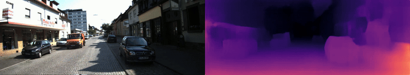

# RT-MonoDepth Usage Guide



This guide explains how to use the RT-MonoDepth project for depth estimation, video visualization, and point cloud generation. This project builds upon the RTMonoDepth model for real-time monocular depth estimation, extending it with point cloud generation capabilities.

## Setup

1. Clone the repository:

```bash
git clone https://github.com/your-username/RT-MonoDepth.git
cd RT-MonoDepth
```

2. Create and activate a virtual environment:

```bash
# Windows
python -m venv venv
.\venv\Scripts\activate

# Linux/Mac
python -m venv venv
source venv/bin/activate
```

3. Install dependencies:

```bash
pip install -r requirements.txt
```

4. Create required output directories:

```bash
mkdir depth_videos
mkdir point_clouds
```

5. Download RTMonoDepth weights:

   - Download the weights from [Google Drive](https://drive.google.com/file/d/1Jf5K3m0DfAqVcVCE6y0cKufEKIHu86sz/view?usp=drive_link)
   - Extract and place the weights in `weights/`
   - The model expects these pre-trained RTMonoDepth model weights to function

## Project Structure

```
RT-MonoDepth/
├── depth_videos/      # Output directory for depth visualization videos
├── point_clouds/      # Output directory for generated point clouds
├── kitti-frames/      # Example input frames
├── weights/           # Model weights
└── test-images/       # Test images for single image processing
```

## Main Scripts

### 1. Process Image Sequence (Video + Point Cloud)

Use `process_sequence.py` to process a sequence of images, generate depth maps, create a visualization video, and build a point cloud.

```bash
python process_sequence.py --weight_path ./weights/RTMonoDepth/full/ms_640_192/ --input_path ./kitti-frames --image_format png
```

This will:

- Show real-time visualization of RGB and depth maps
- Save depth visualization video in `depth_videos/` folder
- Generate and save point cloud in `point_clouds/` folder
- Display the final point cloud in an interactive 3D viewer

**Options:**

- `--weight_path`: Path to model weights directory (required)
- `--input_path`: Path to input image sequence directory (required)
- `--image_format`: Input image format (default: 'jpg')
- `--config`: Path to configuration file (default: 'config.json')
- `--no_cuda`: Disable CUDA if available

### 2. Single Image Depth Estimation

Use `image_to_depth_full.py` for processing individual images:

```bash
python image_to_depth_full.py --image_path ./test-images/1.jpg --weight_path ./weights/RTMonoDepth/full/ms_640_192/
```

This will:

- Generate depth map for the input image
- Display RGB and depth visualization
- Save depth map outputs in the same directory as input image

## Output Files

### Video Output

- Location: `depth_videos/` directory
- Format: MP4
- Content: Side-by-side RGB and depth visualization
- Filename pattern: `{input_folder_name}_depth.mp4`

### Point Cloud Output

- Location: `point_clouds/` directory
- Format: PLY
- Content: 3D point cloud with RGB colors
- Filename pattern: `{input_folder_name}_pointcloud.ply`

## Examples

1. Process KITTI sequence:

```bash
python process_sequence.py --weight_path ./weights/RTMonoDepth/full/ms_640_192/ --input_path ./kitti-frames --image_format png
```

2. Process single image:

```bash
python image_to_depth_full.py --image_path ./test-images/1.jpg --weight_path ./weights/RTMonoDepth/full/ms_640_192/
```

3. Generate point cloud from web cam + depth:

```bash
python depth_to_pointcloud.py --weight_path ./weights/RTMonoDepth/full/ms_640_192/
```

4. Capture from Gazebo simulation camera and run the full sequence pipeline:

```bash
python gazebo_simulation/process_sim_camera.py \
   --weight_path ./weights/RTMonoDepth/full/ms_640_192/ \
   --topic /camera/image \
   --config config_gazebo.json \
   --output_root simulation_frames
```

This subscriber records PNG frames under `simulation_frames/sim_YYYYMMDD_HHMMSS/` and automatically calls `process_sequence.py` once capture stops (Ctrl+C) or reaches `--frame_limit`. Use `--no_preview` to skip the OpenCV window or `--no_cuda` to force CPU inference. The script requires Gazebo Transport Python bindings (`gz-transport`), and you should launch `gazebo_simulation/testing_robot_with_cam.sdf` before starting it.

### Metric Point Cloud Upgrade

- For a line-by-line explanation of the metric depth and point-cloud changes, read `docs/metric_point_cloud_readme.md`.
- If you're new to the theory, start with `docs/beginner_point_cloud_walkthrough.md` for a beginner-friendly overview of assumptions and algorithms.

## Sample Outputs

### Processing Image Sequence

When running `process_sequence.py`, you'll see output like this:

```
Found 28 images to process

Processing frames...
Press 'Q' to stop early
Frame 1/28 - Points: 122880
Frame 2/28 - Points: 122880
...
Frame 28/28 - Points: 122880

Saving point cloud to point_clouds/kitti-frames_pointcloud.ply
Saved point cloud with 3309127 points
```

## Notes

- Required output directories (`depth_videos/`, `point_clouds/`) should be created before running the scripts (see Setup section)
- Point clouds are automatically cleaned using statistical outlier removal
- Videos are saved at 30 FPS with side-by-side visualization
- Uses RTMonoDepth model for accurate real-time depth estimation
